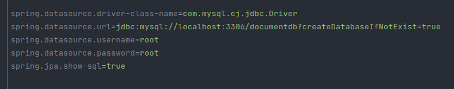

# Microserviço SpringBoot para gerir usuarios

## Sobre

Esta é uma API que tem o objetivo de gerenciar usuários. São utilizadas as tecnologias:

- Java 11
- Maven 3+
- Spring Boot
- Spring Web
- Bean Validation
- Spring Data JPA
- JWT Authentication
- Flyway
- SQL
- Lombok

## Orientações
1. Tenha o MySQL instalado
2. Altere as configurações de conexão com o banco de dados no application.properties se nescessário.

3. Abra o projeto na IDE da sua preferência.
4. Suba a aplicação e explore a API com uma ferramenta como [Postman](https://www.postman.com/).
5. O projeto roda na porta 8080.
6. Arquivo da Collection com os métodos do Postman na raiz do projeto
7. Os seguintes endpoints estão implementados até o momento:

- `POST /users` adiciona um novo usuário
- `GET /users/` obtém uma lista de usuários
- `GET /user/validatePassword` Verifica se o password informado é válido
- `POST /users/validateAuthPass` retorna um JSON Web Token (JWT)
